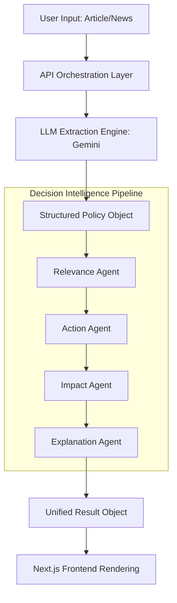

# PolicySense: AI-Native Decision Intelligence Layer

An AI-native personalization layer designed to transform unstructured business and policy news into actionable, decision-ready intelligence.

## Description

PolicySense addresses the gap between abundant news updates and actionable business decisions. While traditional platforms offer generic summaries, PolicySense implements a deterministic multi-agent pipeline to process news through a user-specific context. The system evaluates content for personalized relevance, extracts structured insights via Gemini integration, and generates validated next steps to reduce cognitive load and eliminate ambiguity for MSMEs, founders, and investors.

---

### Technical Workflow Diagram



---

## Getting Started

### Dependencies

* **Runtime**: Node.js 18.x or higher.
* **Framework**: Next.js 15 (App Router).
* **Styling**: Tailwind CSS.
* **LLM Provider**: Google Gemini API access for extraction and synthesis.
* **Environment**: Server-side execution environment for secure API orchestration.

### Installing

* Clone the repository to your local machine.
* Initialize the project and install dependencies:
```bash
npm install
```
* Create a `.env.local` file in the root directory and add your API credentials:
```text
NEXT_PUBLIC_FIREBASE_API_KEY=your_key
NEXT_PUBLIC_FIREBASE_AUTH_DOMAIN=...
GEMINI_API_KEY=your-key
```

### Executing program

* **Step 1: Start the Development Server**
```bash
npm run dev
```
* **Step 2: User Onboarding** 
    * Navigate to `/onboarding` to define the user profile for the Relevance Engine.
* **Step 3: Process News** 
    * Input a business article or policy update link into the dashboard.
* **Step 4: Review Insights** 
    * Analyze the generated relevance score, recommended actions, and impact modeling (action vs. inaction).

## File Structure

```text
policysense
├─ app/                     # Next.js App Router
│  ├─ api/                  # Server-side Extraction & Pipeline Orchestration
│  ├─ auth/                 # Authentication Logic
│  ├─ dashboard/            # Decision Intelligence Interface
│  ├─ onboarding/           # User Context & Profile Setup
│  ├─ layout.tsx            # Global Providers & Layout
│  └─ page.tsx              # Landing Page
├─ components/              # Atomic UI Components
├─ context/                 # Global State Management
├─ lib/                     # Multi-Agent Logic & Schema Definitions
├─ public/                  # Static Assets
├─ scripts/                 # Data Ingestion & Sanitization Scripts
├─ eslint.config.mjs        # Linting Configuration
├─ next.config.ts           # Next.js Production Optimization
└─ tsconfig.json            # Strict TypeScript Configuration
```

## Help

* **Schema Validation Errors**: Ensure the input text is not empty; the LLM Extraction Engine requires valid strings to generate structured JSON.
* **Rate Limiting**: Check the API Orchestration Layer if multiple requests are failing consecutively.
* **Missing Data**: The system uses null-safe fallbacks if specific agent segments fail to return a score.

## Version History

* **0.1**
    * Initial Release: Deterministic pipeline and multi-agent architecture.

## License

This project is licensed under the MIT License.

## Acknowledgments

* **The Economic Times**: For providing the business and policy news context.
* **Google Gemini**: For the LLM Extraction Engine and synthesis capabilities.

